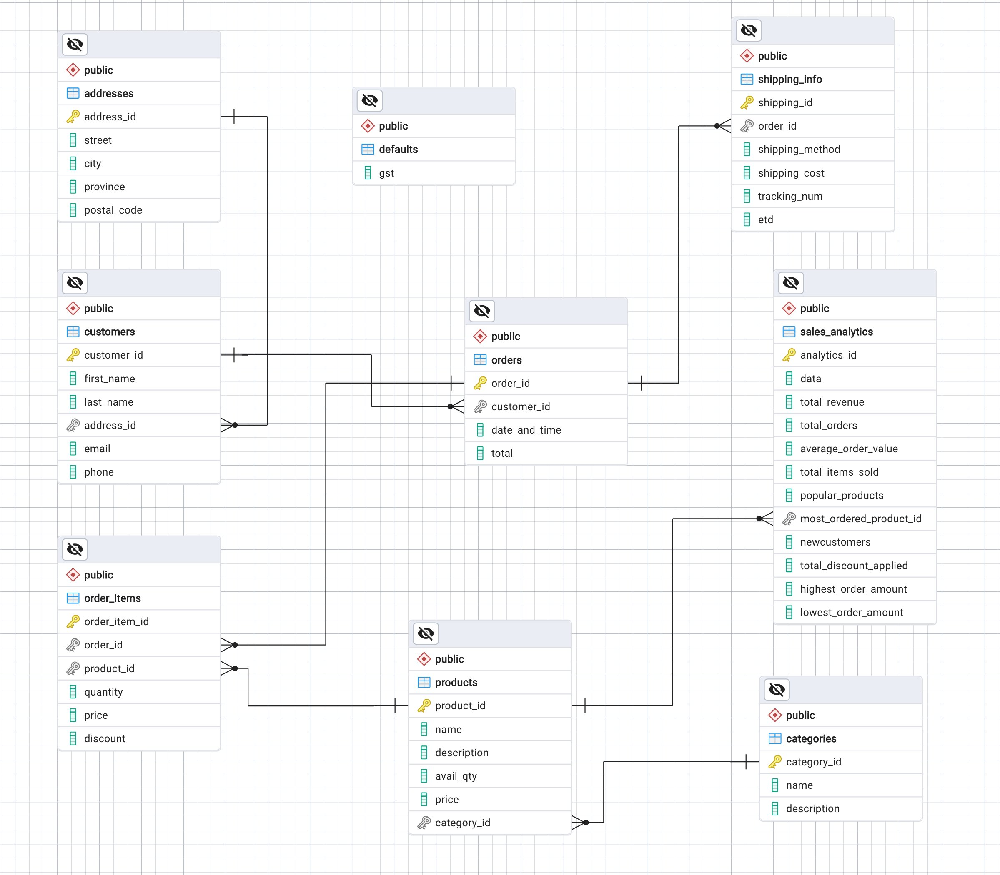

# AOBoutique Retail Database Project

---

## Introduction

The Retail Database is designed to manage the operations of a retail business efficiently. It includes tables for managing customers, products, orders, shipping, and sales analytics.

## Database Schema
The database schema comprises nine meticulously designed tables, each serving a distinct purpose in organizing and storing crucial data.

## Normalization

The database schema is normalized up to at least the third normal form (3NF) to minimize redundancy and ensure data integrity.

## Table Description

### Addresses

- `address_ID`: Primary key for the Addresses table.
- `street`: Street address.
- `city`: City name.
- `province`: Province name.
- `postal_code`: Postal code.

### Customers

- `customer_ID`: Primary key for the Customers table.
- `first_name`: Customer's first name.
- `last_name`: Customer's last name.
- `address_ID`: Foreign key referencing the address of the customer from the Addresses table.
- `email`: Customer's email address.
- `phone`: Customer's phone number.

### Categories

- `category_ID`: Primary key for the Categories table.
- `name`: Category name.
- `description`: Category description.

### Products

- `product_ID`: Primary key for the Products table.
- `name`: Product name.
- `description`: Product description.
- `avail_qty`: Available quantity of the product.
- `price`: Price of the product.
- `category_ID`: Foreign key referencing the category of the product from the Categories table.

### Orders

- `order_ID`: Primary key for the Orders table.
- `customer_ID`: Foreign key referencing the customer who placed the order from the Customers table.
- `date_and_time`: Date and time when the order was placed.
- `total`: Total amount of the order.

### Order_Items

- `order_item_ID`: Primary key for the Order_Items table.
- `order_ID`: Foreign key referencing the order to which the item belongs from the Orders table.
- `product_ID`: Foreign key referencing the product being ordered from the Products table.
- `quantity`: Quantity of the ordered item.
- `price`: Price of the ordered item.
- `discount`: Discount applied to the ordered item.

### Shipping_Info

- `shipping_ID`: Primary key for the Shipping_Info table.
- `order_ID`: Foreign key referencing the order for which shipping information is stored from the Orders table.
- `shipping_method`: Shipping method used.
- `shipping_cost`: Cost of shipping.
- `tracking_num`: Tracking number for the shipment.
- `ETD`: Estimated time of delivery.

### Sales_Analytics

- `analytics_ID`: Primary key for the Sales_Analytics table.
- `data`: Date for which analytics data is recorded.
- `total_revenue`: Total revenue generated.
- `total_orders`: Total number of orders.
- `average_order_value`: Average value of orders.
- `total_items_sold`: Total number of items sold.
- `popular_products`: List of popular products (comma-separated product IDs).
- `most_ordered_product_ID`: Foreign key referencing the most ordered product from the Products table.
- `newCustomers`: Number of new customers.
- `total_discount_applied`: Total discount applied across orders.
- `highest_order_amount`: Highest order amount.
- `lowest_order_amount`: Lowest order amount.

### Defaults

- `gst`: Default GST (Goods and Services Tax) percentage.

---

## Queries and Reports
The database supports various queries and reports, including Category Sales Report, Customer Report, Detailed Order Report, Inventory Report, Order History Report, Product Sales Report, Sales Report.

## Usage

The Retail Database can be used as a backend system for retail management software. Users can interact with the database using SQL queries to retrieve, insert, update, and delete data as required.

## Contributors

[Anzhelika Kuchma](https://github.com/anzhelika-kuchma)

## License

The Retail Database is released under the [MIT License](LICENSE), granting users the freedom to use, modify, and distribute the software.

